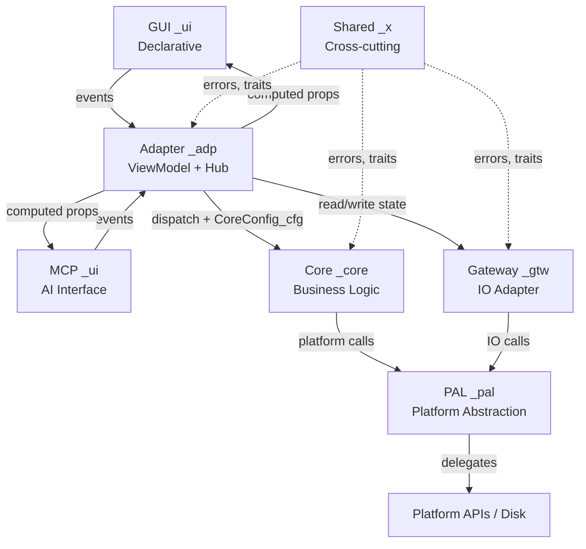

DEPRECATED — see sid-architecture/code-free-of-mutables.md and sid-architecture/data-driven-runtime.md (prototype)

---
tags: [app-model, architecture, mvvm, stateless, hexagonal, gateway]
concepts: [architecture, state-management, mvvm, declarative, hexagonal-mvvm]
requires: [global/topology.md]
feeds: [project-files/uiux-file.md]
related: [global/consistency.md, global/validation.md, global/topology.md, global/adapter-layer.md, global/config-driven.md, global/persistent-state.md, gateway/io.md, gateway/lifecycle.md, adapter/viewmodel.md, adapter/event-flow.md, core/design.md, pal/design.md, web/topology.md, web/README.md]
keywords: [core, pal, adapter, gateway, state, cli, tui, pwa, qt, slint, cfg, sta, gtw]
layer: 1
---
# Application Model

> CORE + PAL + Adapter + Gateway — stateless components, per-layer persistent state

---

VITAL: All apps follow this 6-layer hexagonal MVVM model — no exceptions
VITAL: Per-layer `_sta` structs hold all mutable state — Gateway persists them
RULE: CORE = pure business logic, no UI, no platform
RULE: PAL = platform abstraction layer, stateless
RULE: Adapter = data exchange hub, ViewModel, event routing — see adapter-layer.md
RULE: Gateway = IO adapter, loads config+state on startup, saves on shutdown
RULE: UI = declarative, stateless, MVVM for all except CLI
RULE: CSS tokens and design values live in UiConfig_cfg / AdapterState_sta
BANNED: Mutable state outside `_sta` structs
BANNED: UI logic in CORE
BANNED: Platform calls without PAL
BANNED: Imperative UI mutation
BANNED: Disk IO outside Gateway

## App Types

| Type | UI Framework | MVVM |
|------|-------------|------|
| CLI | argparse / clap | No |
| TUI | Textual / ratatui | Yes |
| WS | WebSocket server | No |
| WA | React / Svelte / SolidJS | Yes |
| PWA | React / Svelte / SolidJS + SW | Yes |
| Desktop | Qt / Slint / GTK4 | Yes |
| Mobile | Compose / SwiftUI | Yes |
| MCP | MCP server (`--mcp` flag) | Yes — same Adapter as GUI |

RULE: CLI is the only type without MVVM — it maps args directly to CORE calls
RULE: All UI types use declarative rendering from AdapterState_sta

## Per-Layer State Model

Each layer owns its own state struct (`_sta`). Gateway loads and persists all of them.

VITAL: No single global state store — state is distributed per layer, coordinated by Gateway
RULE: AdapterState_sta = UI view state (selected items, scroll pos, loading flags)
RULE: CoreState_sta = domain session state (caches, computed results, active sessions)
RULE: GatewayState_sta = IO state (connection pool, retry counts, last-sync timestamps)
RULE: All `_sta` structs implement `Persistable_x` — Gateway handles disk IO
RULE: UI reacts to changes in AdapterState_sta — observable, not polled
RULE: CSS design tokens live in UiConfig_cfg — theme switching = config reload

```
Gateway (startup)
├── loads AppConfig_cfg → distributes cfg to each layer
├── loads AdapterState_sta → hands to Adapter
├── loads CoreState_sta → hands to Core
└── loads GatewayState_sta → retains internally

Gateway (shutdown)
├── serializes AdapterState_sta → disk
├── serializes CoreState_sta → disk
└── serializes GatewayState_sta → disk
```

See persistent-state.md for full state lifecycle rules.

## CORE

Pure business logic — no dependencies on UI or platform.

RULE: CORE is input to output — pure functions where possible
RULE: CORE reads from CoreState_sta, writes results back to CoreState_sta
BANNED: Import UI frameworks in CORE
BANNED: Import platform APIs in CORE
BANNED: Side effects without PAL

## PAL — Platform Abstraction Layer

Wraps platform-specific APIs behind a stable interface.

RULE: PAL is stateless — it delegates to platform, returns result
RULE: One PAL interface, multiple implementations (Linux, macOS, Windows, Web)
RULE: File I/O, networking, clipboard, notifications — all through PAL

## Gateway — IO Adapter

Loads config and state on startup, saves state on shutdown. The only layer touching disk.

RULE: Gateway is initialized first — all other layers receive config+state from it
RULE: Gateway uses PAL for all actual IO — no direct syscalls
RULE: One Gateway per app — it is the IO boundary
BANNED: Other layers reading/writing files directly
BANNED: Gateway containing business logic — it only marshals IO

See config-driven.md and persistent-state.md for full Gateway rules.

## Adapter (ViewModel + Data Hub)

Routes events between UI and Core, transforms data, holds AdapterState_sta.

RULE: Adapter is the only layer that imports from all other layers
RULE: Adapter reads AdapterState_sta, exposes computed properties for UI
RULE: Adapter receives UI events, validates input shape, dispatches to CORE
RULE: One Adapter module per major view or feature area
BANNED: Business logic in Adapter — delegate to CORE

See adapter-layer.md for full Adapter rules.

## UI — Declarative Layer

Describes what the user sees — never how to mutate the DOM/widget tree.
`_ui` covers both GUI (human interface) and MCP server (AI interface).

RULE: UI binds to Adapter properties — no direct state struct access
RULE: UI is stateless — all state comes from Adapter
RULE: UI sends events to Adapter — never calls CORE directly
RULE: MCP server is `_ui` — it is the AI's rendering surface, not a bus or gateway
RULE: `--mcp` flag switches the UI surface from GUI to MCP — full stack otherwise identical
BANNED: `setState`, `getElementById`, imperative widget updates
BANNED: Inline business logic in templates/views
BANNED: MCP server calling Core or Gateway directly — must route through Adapter

## Architecture Diagram



RESULT: Predictable apps — state distributed per layer, IO centralized in Gateway
REASON: AI can reason about each layer independently; grep `_sta` finds all state, grep `_gtw` finds all IO


---

<!-- LARS:START -->
<a href="https://lpmathiasen.com">
  
</a>
<!-- LARS:END -->
