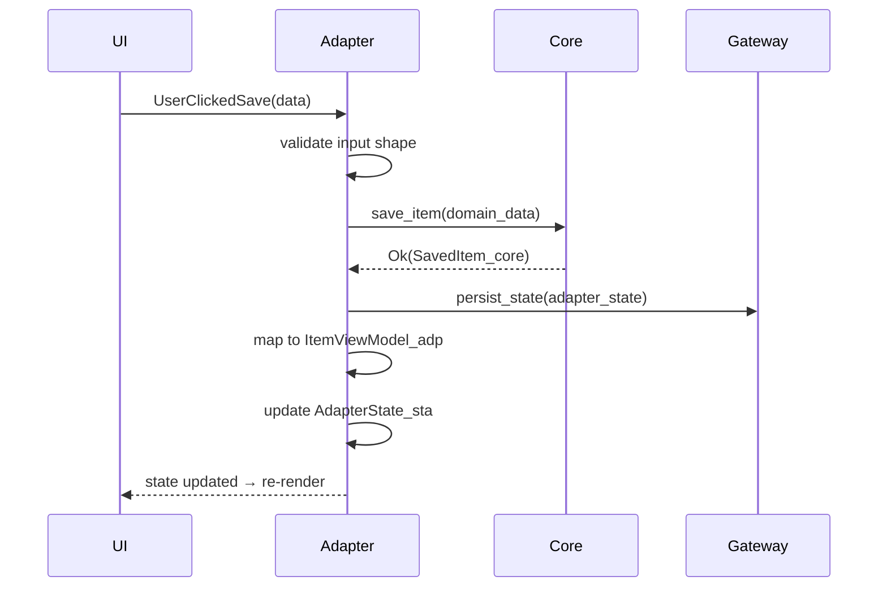

# Adapter Layer

> Adapter is the data exchange hub — the only layer that knows all others

---

VITAL: Adapter is the ONLY layer that imports from all other layers
VITAL: Adapter holds AdapterState_sta — the ViewModel state for the UI
RULE: All UI↔Core communication flows through Adapter
RULE: Adapter transforms data between representations — Core domain ↔ UI view model
RULE: Adapter receives UI events, validates them, dispatches to Core
RULE: Adapter reads Core results, maps to UI-ready structs, stores in AdapterState_sta
RULE: One Adapter module per major view or feature area
BANNED: Business logic in Adapter — delegate to Core
BANNED: Direct UI↔Core communication — Adapter is the mandatory intermediary
BANNED: Direct UI↔Gateway communication — Adapter mediates all state access
BANNED: Adapter importing platform-specific APIs — use PAL through Core

## Adapter as Data Hub

The Adapter sits at the center of the hexagon. It is not a passive mapper — it is an
active routing layer that:

1. **Receives** events from UI
2. **Validates** input shape (not business rules — that's Core)
3. **Dispatches** to Core with correct parameters
4. **Receives** Core results
5. **Transforms** domain data into UI view models
6. **Updates** AdapterState_sta
7. **Triggers** UI re-render via observable state

```
UI event
   │
   ▼
Adapter.handle_event()
   ├── validate input shape
   ├── call Core.process()
   │     └── Core returns domain result
   ├── map result → UI view model
   └── update AdapterState_sta → UI re-renders
```

## AdapterState_sta

Each Adapter owns a state struct for its view's current state.

RULE: AdapterState_sta contains only UI-facing data — not domain objects
RULE: AdapterState_sta is persisted by Gateway on shutdown — see persistent-state.md
RULE: UI reads exclusively from AdapterState_sta — never from Core directly
RULE: AdapterState_sta is initialized from Gateway on startup

```
AdapterState_sta {
    // What the user sees right now
    selected_item: Option<ItemViewModel_adp>,
    list_items: Vec<ItemViewModel_adp>,
    is_loading: bool,
    error_message: Option<String_x>,
    // UI state (scroll, focus, expanded panels)
    scroll_offset: u32,
    active_panel: PanelId_ui,
}
```

## Sequence Diagram — Event Flow



## View Model Types

RULE: View model types are tagged `_adp` — they are Adapter-layer types
RULE: View models are flat, serializable structs — no domain logic
RULE: Domain objects (`_core`) never reach the UI — always mapped first

```
// Good — view model in Adapter
ItemViewModel_adp { id: Uuid_x, display_name: String, formatted_price: String }

// Bad — domain object leaking to UI
Item_core { id: Uuid_x, price: Money_core, tax_rules: Vec<TaxRule_core> }
```

RESULT: UI never needs to understand domain rules — it only renders what Adapter gives it
REASON: Adapter decoupling means Core and UI can evolve independently
