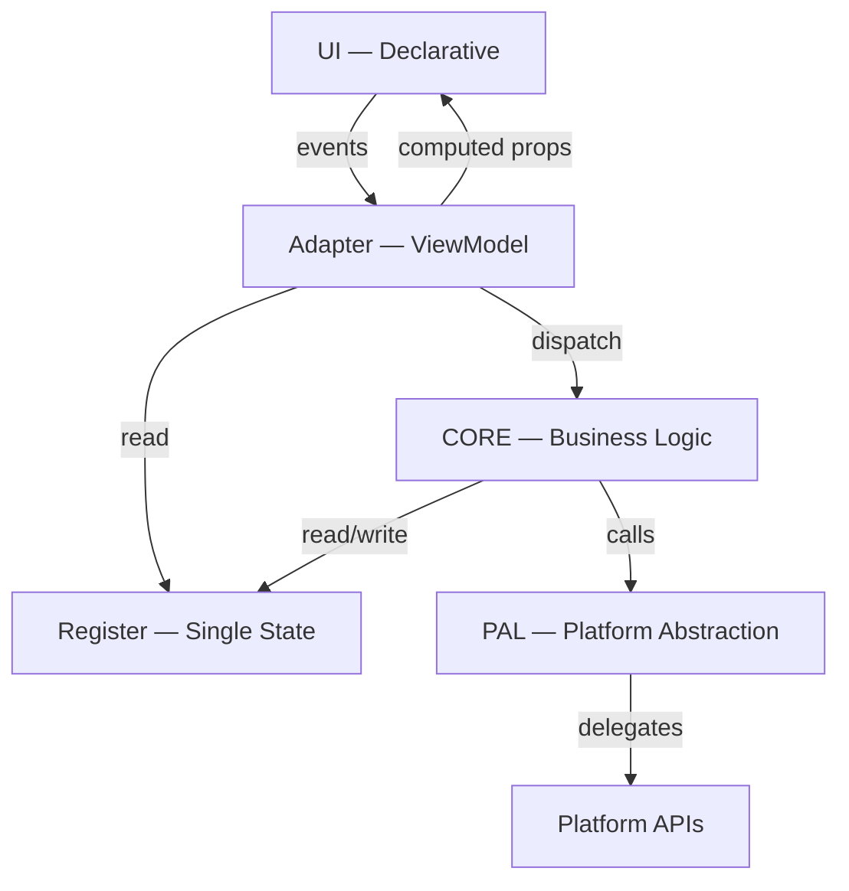

# Application Model

> CORE + PAL + Adapter + Register — stateless components, single mutable register

---

VITAL: All apps follow this model — no exceptions
VITAL: Register is the only mutable state — all components are stateless
RULE: CORE = pure business logic, no UI, no platform
RULE: PAL = platform abstraction layer, stateless
RULE: Adapter = maps Register to/from UI (ViewModel in MVVM)
RULE: UI = declarative, stateless, MVVM for all except CLI
RULE: CSS tokens and design values live in Register
BANNED: Mutable state outside Register
BANNED: UI logic in CORE
BANNED: Platform calls without PAL
BANNED: Imperative UI mutation

## App Types

| Type | UI Framework | MVVM |
|------|-------------|------|
| CLI | argparse / clap | No |
| TUI | Textual / ratatui | Yes |
| WS | WebSocket server | No |
| WA | React / Svelte / SolidJS | Yes |
| PWA | React / Svelte / SolidJS + SW | Yes |
| Desktop | Qt / Slint / GTK4 | Yes |
| Mobile | Compose / SwiftUI | Yes |

RULE: CLI is the only type without MVVM — it maps args directly to CORE calls
RULE: All UI types use declarative rendering from Register state

## Register

The Register is the single source of truth for all application state.

VITAL: One Register per app — no secondary state stores
VITAL: All state lives here — domain data, UI state, CSS tokens, user prefs
RULE: Register is observable — UI reacts to changes automatically
RULE: CSS design tokens (colors, spacing, typography) are Register values
RULE: Theme switching = Register update, not CSS file swap

```
Register
├── domain/       # Business data
├── ui/           # View state (selected tab, scroll pos)
├── tokens/       # Design tokens (colors, spacing, fonts)
└── prefs/        # User preferences (theme, locale)
```

## CORE

Pure business logic — no dependencies on UI or platform.

RULE: CORE is input to output — pure functions where possible
RULE: CORE reads from Register, writes results back to Register
BANNED: Import UI frameworks in CORE
BANNED: Import platform APIs in CORE
BANNED: Side effects without PAL

## PAL — Platform Abstraction Layer

Wraps platform-specific APIs behind a stable interface.

RULE: PAL is stateless — it delegates to platform, returns result
RULE: One PAL interface, multiple implementations (Linux, macOS, Windows, Web)
RULE: File I/O, networking, clipboard, notifications — all through PAL

## Adapter (ViewModel)

Maps Register state to UI-ready representations.

RULE: Adapter reads Register, exposes computed properties for UI
RULE: Adapter receives UI events, dispatches to CORE
RULE: One Adapter per view/screen
BANNED: Business logic in Adapter — delegate to CORE

## UI — Declarative Layer

Describes what the user sees — never how to mutate the DOM/widget tree.

RULE: UI binds to Adapter properties — no direct Register access
RULE: UI is stateless — all state comes from Adapter
RULE: UI sends events to Adapter — never calls CORE directly
BANNED: `setState`, `getElementById`, imperative widget updates
BANNED: Inline business logic in templates/views

## Architecture Diagram



RESULT: Predictable apps — state in one place, logic separated from presentation
REASON: AI can reason about each layer independently
