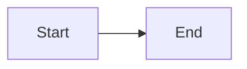

# Diagrams: Mermaid Only

> Text-based, version-controlled, AI-readable diagrams

---

VITAL: ALL diagrams in Mermaid format — no exceptions
VITAL: Mermaid renders natively in GitHub, GitLab, VS Code, Obsidian
VITAL: Text-based = version controlled, diffable, AI-readable

## Use Cases

| Type | Syntax |
|------|--------|
| Architecture | `flowchart TB/LR` |
| Sequences | `sequenceDiagram` |
| State machines | `stateDiagram-v2` |
| ER diagrams | `erDiagram` |
| Class diagrams | `classDiagram` |
| Gantt charts | `gantt` |
| Git graphs | `gitGraph` |

## Syntax

````markdown

````

## Style Tips

- Use `subgraph` for grouping
- Use `style NodeID fill:#e1f5fe` for colors
- Use `Note over A,B: Description` in sequences
- Keep diagrams focused — split if complex

BANNED: ASCII art diagrams
BANNED: External diagram tools (draw.io, Lucidchart) for docs
BANNED: Image-only diagrams (no source)

## Why Mermaid

- AI can read/write/modify Mermaid
- Git tracks changes
- No external tools needed
- Renders in GitHub web, VS Code, GitLab, Obsidian, JetBrains

NOTE: GitHub mobile app shows raw code (not rendered) — acceptable tradeoff.
Mermaid syntax is readable as text anyway.

REFERENCE: https://mermaid.js.org/syntax/
