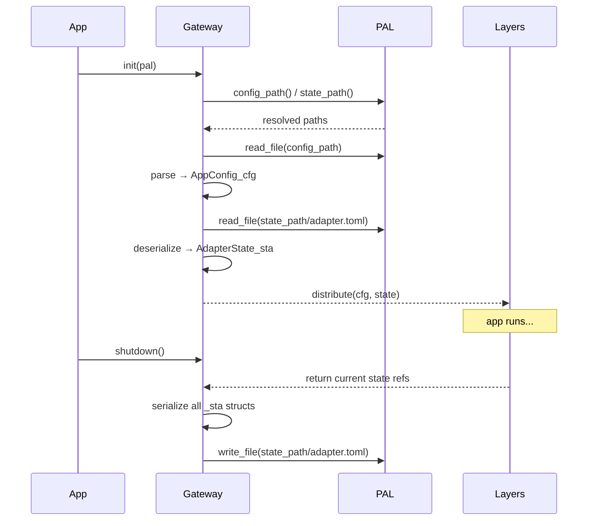

# Persistent State

> Per-layer state structs — Gateway handles all disk IO, layers own their state

---

VITAL: Gateway is the ONLY layer that reads from or writes to disk for state
VITAL: Each layer owns exactly one `_sta` struct for its persistent state
RULE: State structs are tagged `_sta` — this is distinct from the layer tag
RULE: `<Layer>State_sta` prefix identifies the owning layer (AdapterState_sta, CoreState_sta)
RULE: Gateway loads all state on startup, distributes to layers as parameters
RULE: Gateway saves all state on shutdown (or explicit flush)
RULE: Layers never call disk IO directly — they hand state back to Gateway
RULE: `Persistable_x` trait is the contract between Gateway and state structs
BANNED: Global mutable state
BANNED: Disk access (file read/write) outside Gateway
BANNED: State embedded in domain objects (`_core` types hold domain data, not session state)
BANNED: State stored in UI components — UI is stateless, state lives in `_sta` structs

## State vs Config

```
_sta  = session state — changes during runtime, persisted at shutdown
_cfg  = configuration — fixed at startup, never mutated during session
```

RULE: If a value changes while the app runs → it's state (`_sta`)
RULE: If a value only changes between runs (via config file edit) → it's config (`_cfg`)

## State Struct Naming

RULE: State struct name = `<OwnerLayer>State_sta`
RULE: Prefix shows ownership — `grep <Layer>State` finds the owner immediately

| Struct | Owner Layer | Location |
|--------|-------------|----------|
| `AdapterState_sta` | Adapter | `src/adapter/state.rs` |
| `CoreState_sta` | Core | `src/core/state.rs` |
| `GatewayState_sta` | Gateway | `src/gateway/state.rs` |
| `UiState_sta` | UI | `src/ui/state.rs` |

RULE: `grep _sta` finds all state structs across all layers
REASON: The `_sta` tag is grep-searchable topology — one command, all state types

## Persistable_x Trait

Gateway knows only the `Persistable_x` trait — it never imports concrete state types.
This keeps Gateway decoupled from individual layer implementations.

```
// In src/shared/ — cross-cutting trait
trait Persistable_x {
    fn state_key() -> &'static str;       // Unique key for this state's file
    fn serialize(&self) -> Result<String, AppError_x>;
    fn deserialize(data: &str) -> Result<Self, AppError_x> where Self: Sized;
}

// Gateway uses trait, not concrete type
fn save_all(states: &[&dyn Persistable_x]) -> Result<(), AppError_x> {
    for state in states {
        let path = state_path(state.state_key());
        pal.write_file(&path, &state.serialize()?)?;
    }
    Ok(())
}
```

RULE: Each `_sta` struct implements `Persistable_x`
RULE: Gateway collects all `_sta` refs at startup registration — no runtime discovery

## Disk Layout

RULE: Config files in `~/.config/<app>/config/` — read-only during session
RULE: State files in `~/.config/<app>/state/` — read on startup, written on shutdown
RULE: Gateway discovers paths via PAL — never hardcodes `~/.config`

```
~/.config/<app>/
├── config/
│   └── app.toml           # AppConfig_cfg (user-editable)
└── state/
    ├── adapter.toml        # AdapterState_sta
    ├── core.toml           # CoreState_sta
    └── gateway.toml        # GatewayState_sta
```

## Startup / Shutdown Sequence



RESULT: State survives app restarts — users return to where they left off
REASON: Centralized IO means state corruption is Gateway's problem, not every layer's


---

<!-- LARS:START -->
<a href="https://lpmathiasen.com">
  
</a>
<!-- LARS:END -->
