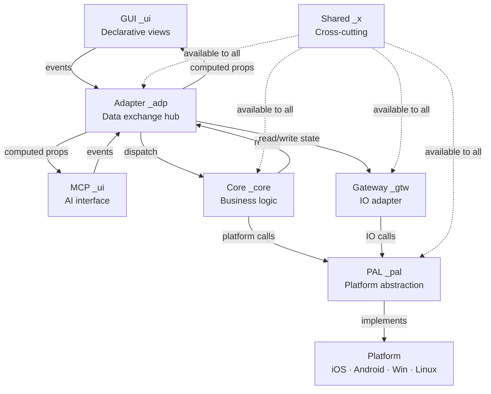

# Application Topology

> 6-layer hexagonal MVVM — every file has a home, every import has a direction

---

AXIOM: This topology is non-negotiable — it is the foundation all other rules build on.
AXIOM: No project may deviate from this structure — not partially, not temporarily, not "for simplicity".
AXIOM: If a rule seems to conflict with topology, topology wins.

VITAL: All projects follow this 6-layer folder topology — no exceptions
VITAL: Import direction is one-way — lower layers never import higher layers
RULE: Each type's suffix tag matches its folder (e.g. `_adp` lives in `src/adapter/`)
RULE: Folder name maps directly to suffix tag — no ambiguity
RULE: Gateway is the only layer that touches external IO (disk, network, processes)
RULE: Adapter is the only layer that imports from all other layers
BANNED: Circular imports between layers
BANNED: UI importing Core directly — all communication goes through Adapter
BANNED: Core importing UI, Adapter, or Gateway
BANNED: Types living outside their designated folder

## Folder → Tag Mapping

| Folder | Tag | Role |
|--------|-----|------|
| `src/ui/` | `_ui` | Declarative UI layer — views, components, templates; or MCP server (AI interface) |
| `src/adapter/` | `_adp` | Data exchange hub — routing, transformation, ViewModel |
| `src/core/` | `_core` | Business logic — pure functions, domain rules |
| `src/pal/` | `_pal` | Platform abstraction — OS, window, filesystem interface |
| `src/gateway/` | `_gtw` | IO adapter — loads config+state, saves at shutdown |
| `src/shared/` | `_x` | Cross-cutting — errors, results, shared traits |

RULE: A type tagged `_adp` lives in `src/adapter/` — tag and folder always agree
RULE: State structs use `_sta` tag regardless of layer — see persistent-state.md
RULE: Config structs use `_cfg` tag regardless of layer — see config-driven.md

## Dependency DAG

```
GUI (_ui)  ◄──props───┐
                       │  Adapter  ──dispatch──►  Core
MCP (_ui)  ◄──data────┘    │◄────── results ────┤
    │                       │                     │
    └──events──────────────►│                     ▼
GUI └──events──────────────►│              PAL  ──abstracts──►  Platform
                             ▼              (iOS, Android, Win, Linux)
                          Gateway ──IO──►
                             │              ▲
                             └──────────────┘
```

RULE: GUI and MCP are both `_ui` — alternative rendering surfaces for the same Adapter state
RULE: `--mcp` flag switches the UI surface from GUI to MCP — Core, Gateway, PAL are identical in both modes

RULE: UI ↔ Adapter (events up, computed props down)
RULE: Adapter → Core (dispatch); Core → Adapter (results/reads)
RULE: Core → PAL (platform operations from business logic)
RULE: Adapter → Gateway (state read/write)
RULE: Gateway → PAL (disk/network IO via platform abstraction)
RULE: PAL → Platform APIs (iOS, Android, Windows, Linux — all platform targets are PAL implementations)
RULE: Shared (`_x`) may be imported by any layer
BANNED: Core → Adapter, Core → UI, Core → Gateway (direct)
BANNED: UI → Core (must go through Adapter)
BANNED: PAL → Core, PAL → Adapter, PAL → UI, PAL → Gateway

## Forbidden Cross-Suffix Imports

Derived directly from the DAG — a static scanner enforces these by grepping import lines for suffix co-occurrence:

| File suffix | BANNED from importing |
|-------------|----------------------|
| `_ui` | `_core`, `_pal`, `_gtw` — must route through `_adp` |
| `_core` | `_adp`, `_ui`, `_gtw` — Core is pure; calls only `_pal` |
| `_pal` | `_core`, `_adp`, `_ui`, `_gtw` — PAL is the bottom layer |
| `_gtw` | `_adp`, `_ui` — Gateway calls `_pal`; does not know Adapter or UI |
| `_adp` | *(hub — may reference all layers)* |
| `_x` | *(shared — no import restrictions)* |

BANNED: `_ui` file importing a `_core` type — UI must not know Core exists
BANNED: `_ui` file importing a `_pal` type — UI must not know platform exists
BANNED: `_ui` file importing a `_gtw` type — UI must not know IO exists
BANNED: `_core` file importing a `_adp` type — Core must not know Adapter exists
BANNED: `_core` file importing a `_ui` type — Core must not know UI exists
BANNED: `_core` file importing a `_gtw` type — Core must not know IO exists
BANNED: `_pal` file importing a `_core` type — PAL must not know domain exists
BANNED: `_pal` file importing a `_adp` type — PAL must not know Adapter exists
BANNED: `_pal` file importing a `_ui` type — PAL must not know UI exists
BANNED: `_pal` file importing a `_gtw` type — PAL must not know Gateway exists
BANNED: `_gtw` file importing a `_adp` type — Gateway must not know Adapter exists
BANNED: `_gtw` file importing a `_ui` type — Gateway must not know UI exists

RULE: `_sta` and `_cfg` types follow their host layer's import rules
RULE: A `_core` file importing a `_adp` type is always a placement error — move the logic up
RESULT: `grep "_adp" src/core/` returning hits = architecture violation

## Architecture Diagram



## Placement Rules

RULE: New type → pick folder → apply matching tag → done
RULE: If a type spans two layers, split it or move it to `_x`
RULE: Tests live in `tests/` mirroring `src/` — test types use `_test` tag
BANNED: `utils/`, `helpers/`, `misc/` folders — every file belongs to a layer
BANNED: Adapter logic in Core or PAL

RESULT: Folder structure is self-documenting — grep `_gtw` to find all gateway types
REASON: Placement is architectural enforcement — wrong folder = wrong design

## Mother–Child Ownership (applies at every level)

The same ownership principle applies within each layer and within each module:

VITAL: At every level there is exactly **one owner** of state and layout for that scope — the "mother"
VITAL: All other modules at that level are **stateless children** — they receive what they need, emit events up
RULE: Mother passes state down as props/arguments — children never fetch, query, or derive their own state
RULE: Children emit events up — mother decides what happens next
RULE: Siblings never communicate directly — all coordination routes through their shared mother
RULE: Children have no knowledge of each other — they are independently understandable files

At the **system level**:
- Adapter is mother — it owns AdapterState_sta (the ViewModel state) and coordinates all layers
- Each layer also owns its own `_sta` struct (see persistent-state.md) — "mother" means Adapter coordinates, not that it holds all state in one place
- Core, Gateway, PAL are stateless children — pure functions / IO that receive what they need

At the **UI level** (see uiux/mother-child.md):
- Window / root component is mother — owns all view state, sizes, active panel
- Views are stateless children — fill their slot, emit events up
- Modules are children of views — views become mother for their subtree

At the **module level** (Rust):
- `mod.rs` / `main.rs` / `lib.rs` = mother files — compose and wire children
- Child `.rs` files = stateless — receive state as parameters, return results
- Children never own `static`, `lazy_static!`, `thread_local!`, or `OnceLock` — state belongs in mother

```rust
// src/callbacks/mod.rs — MOTHER (composes children)
pub struct SharedState { /* owned here, passed to children */ }

pub fn register_all(ui: &AppWindow, state: SharedState) {
    canvas::register(ui, &state);     // delegate
    inspector::register(ui, &state);  // delegate
    file_ops::register(ui, &state);   // delegate
}

// src/callbacks/canvas.rs — CHILD (stateless)
pub fn register(ui: &AppWindow, state: &SharedState) {
    // receives state, registers callbacks — no static, no OnceLock
}
```

RULE: Apply this pattern recursively — every subtree has exactly one mother
BANNED: Mother files with many `fn` definitions — extract to child modules
BANNED: Child files with `static` or state-owning constructs — state belongs in mother
BANNED: Children that own state shared with siblings — route through mother
BANNED: Children that reach outside their subtree for state — mother passes it down
RESULT: Any module can be understood, tested, and replaced by reading exactly one file
REASON: Single ownership eliminates hidden coupling — AI only needs one file's context to reason correctly
