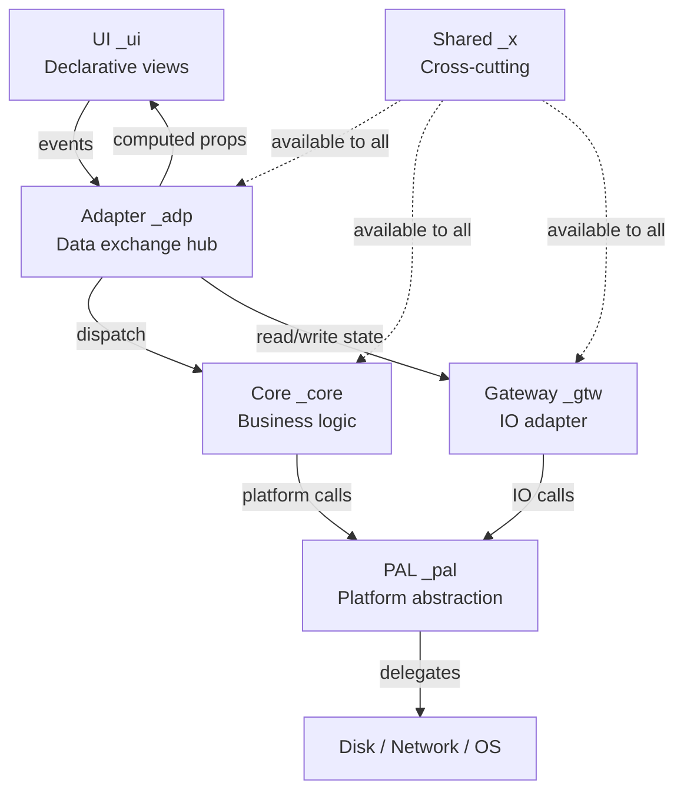

# Application Topology

> 6-layer hexagonal MVVM — every file has a home, every import has a direction

---

VITAL: All projects follow this 6-layer folder topology — no exceptions
VITAL: Import direction is one-way — lower layers never import higher layers
RULE: Each type's suffix tag matches its folder (e.g. `_adp` lives in `src/adapter/`)
RULE: Folder name maps directly to suffix tag — no ambiguity
RULE: Gateway is the only layer that touches external IO (disk, network, processes)
RULE: Adapter is the only layer that imports from all other layers
BANNED: Circular imports between layers
BANNED: UI importing Core directly — all communication goes through Adapter
BANNED: Core importing UI, Adapter, or Gateway
BANNED: Types living outside their designated folder

## Folder → Tag Mapping

| Folder | Tag | Role |
|--------|-----|------|
| `src/ui/` | `_ui` | Declarative UI layer — views, components, templates |
| `src/adapter/` | `_adp` | Data exchange hub — routing, transformation, ViewModel |
| `src/core/` | `_core` | Business logic — pure functions, domain rules |
| `src/pal/` | `_pal` | Platform abstraction — OS, window, filesystem interface |
| `src/gateway/` | `_gtw` | IO adapter — loads config+state, saves at shutdown |
| `src/shared/` | `_x` | Cross-cutting — errors, results, shared traits |

RULE: A type tagged `_adp` lives in `src/adapter/` — tag and folder always agree
RULE: State structs use `_sta` tag regardless of layer — see persistent-state.md
RULE: Config structs use `_cfg` tag regardless of layer — see config-driven.md

## Dependency DAG

```
UI  ──events──►  Adapter  ──dispatch──►  Core
                    │                      │
                    │◄─────── reads ───────┘
                    │
                    ▼
                 Gateway  ──IO──►  Disk / Network / OS
                    │
                    ▼
                  PAL  ──abstracts──►  Platform APIs
```

RULE: UI → Adapter → Core (event flow)
RULE: Adapter → Gateway (for state read/write)
RULE: Core → PAL (for platform operations)
RULE: Gateway → PAL (for disk/network IO)
RULE: Shared (`_x`) may be imported by any layer
BANNED: Core → Adapter, Core → UI, Core → Gateway (direct)
BANNED: UI → Core (must go through Adapter)
BANNED: PAL → Core, PAL → Adapter, PAL → UI

## Architecture Diagram



## Placement Rules

RULE: New type → pick folder → apply matching tag → done
RULE: If a type spans two layers, split it or move it to `_x`
RULE: Tests live in `tests/` mirroring `src/` — test types use `_test` tag
BANNED: `utils/`, `helpers/`, `misc/` folders — every file belongs to a layer
BANNED: Adapter logic in Core or PAL

RESULT: Folder structure is self-documenting — grep `_gtw` to find all gateway types
REASON: Placement is architectural enforcement — wrong folder = wrong design
